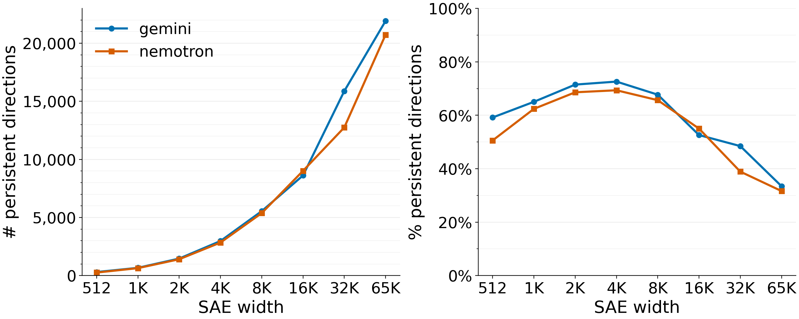
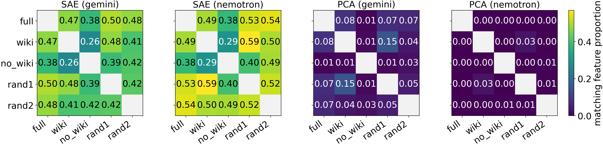
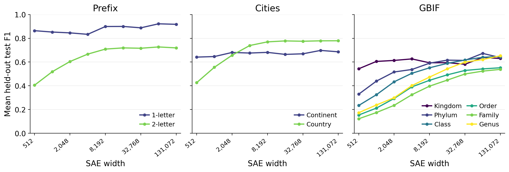

# A Testable Theory of Atomic Features

This repository contains the code needed to reproduce the results in *A Testable Theory of Atomic Features*. It includes code for computing embeddings, training SAEs, and evaluation.

The paper takes a scientific theory approach to understanding language model representations: taking a formalization of the linear representation hypothesis as a postulate, mathematically deriving implications, and testing the predictions. The repository is focused on the last step.

We train a large family of SAEs, of sizes ranging from 512 to 131,072, on about 90M embeddings from gemini-embedding-2 and llama-nemotron-embed-8b. Our main results are as follows:

**Figure 2a — Persistence across SAE size.** Counts and proportions of directions matched in every larger SAE at cosine similarity ≥ 0.7.



**Figure 2b — Stability across data distributions.** Proportions of matching directions between dictionaries trained on different distributions, comparing SAEs with PCA at cosine similarity ≥ 0.7 (absolute cosine for PCA).



**Figure 2c — Hierarchical recovery.** Mean held-out test F1 by hierarchy level and SAE width, pooling category–model pairs across Gemini and Nemotron.



## Overview of code

The code here implements the paper's data preparation, model training, and evaluations. The table below describes each part of the experimental procedure along with its implementation.

| Experimental component | Implementation | Details |
| --- | --- | --- |
| **Training data and embeddings** | [data_prep/](data_prep/) and [trainer/dataset.py](trainer/dataset.py) | Dataset sources, PAQ/MIRACL sampling, text preparation, Gemini/Nemotron embedding calls, and embedding-shard loading for training. |
| **SAE architecture and training procedure** | [trainer/sae.py](trainer/sae.py), [trainer/train.py](trainer/train.py), and [generate_model_configs.py](scripts/generate_model_configs.py) | `TopKSAE` gives the SAE architecture we use. The training loop handles optimization and checkpoints; the config generator specifies dataset mixtures, widths, sparsities, seeds, and training budgets. |
| **P1: Persistence across SAE sizes (Figure 2a)** | [matching.py](src/atomic_features/matching.py) and [paper_pairwise_persistence.py](scripts/stability/paper_pairwise_persistence.py) | Independent maximum matchings against each larger dictionary, and calculation of persistent counts and proportions used for the figure. |
| **P2: Stability across training distributions (Figure 2b)** | [paper_signed_cosine_figures.py](scripts/stability/paper_signed_cosine_figures.py) and [paper_sae_pca_split_heatmaps.py](scripts/stability/paper_sae_pca_split_heatmaps.py) | The `splits()` function constructs signed-cosine SAE comparisons and absolute-cosine PCA comparisons. The heatmap script produces the figure. |
| **P3: Hierarchical recovery (Figure 2c)** | [hierarchy_data_prep/](hierarchy_data_prep/), [hierarchy_probe_computation.py](scripts/hierarchy/hierarchy_probe_computation.py), and [plot_hierarchy_mean_f1_lines.py](scripts/hierarchy/plot_hierarchy_mean_f1_lines.py) | Prefix, Cities, and GBIF target construction and data splits; feature and activation-threshold selection on training rows; held-out F1 evaluation and pooling across category–model pairs used for the figure. |
| **Sparsity, seed, and prevalence controls** | [review_controls/](scripts/review_controls/) and [run_hierarchy_recovery_k128.py](scripts/hierarchy/run_hierarchy_recovery_k128.py) | Sparsity and seed-based parameter changes, and measurements of activation prevalence and recovery. |
| **Synthetic recovery experiments** | [distributions.py](experiments/recovery_principle/code/distributions.py) and [synthetic experiment programs](experiments/recovery_principle/scaling/billion/code/) | The flat and hierarchical generating distributions; `make_configs.py` specifies parameter grid, `run.py` trains, and `evaluate.py` evaluates the recovery principle. |
| **Molecules and illustrative examples** | [hierarchy analyses](scripts/hierarchy/), [containment examples](scripts/containment/), [colors](experiments/colors/README.md), and [dates](experiments/day_of_year/SUMMARY_FIGURE.md) | Linear reconstructions of directions as molecules, food/music hierarchy examples, and manifold construction. |

The [paper-to-code map](REPRODUCTION.md#figure-table-and-number-reproduction-map) connects individual figures and tables to their workflows, inputs, and numerical conventions. In [registry.json](registry.json), each `analyses` entry lists the paper reference, implementation files (`code`), and method; `workflows` gives the concrete commands, required inputs, and outputs.

Data preparation, numerical computation, and plotting are distinct steps; many renderers read saved counts or fitted probes. The [evaluation definitions](REPRODUCTION.md#evaluation-definitions-and-reproducibility) explain matching, probe selection, and aggregation in prose, while [tests/](tests/) provides small examples of the numerical rules and edge cases.

## Running the code

Configure the data, embeddings, model weights, activation caches, fonts, and curated example selections needed by the stage you want to run. Use Python 3.10 or later:

```bash
python -m venv .venv
source .venv/bin/activate
python -m pip install -c constraints.txt '.[paper]'
python paper.py list
python paper.py guide
cp resources.example.json /path/to/resources.json
```

Edit the configuration to point to your resources and choose a new work directory outside this source directory. Then:

```bash
python paper.py prepare --config /path/to/resources.json
python paper.py plan persistence --config /path/to/resources.json
python paper.py run persistence --config /path/to/resources.json
```

`prepare` copies the source and selected inputs into the work directory. It records the copied source hashes in `reproduction_state.json`. Prepare a new work directory after changing source or configuration. Prepared source is checked before execution. `plan` checks declared inputs; `run` records commands, logs and output hashes. Families group related stages:

```bash
python paper.py list --family hierarchy
```

For training, install `.[paper,training]`; embedding/data preparation additionally uses `.[providers]`. Large KMeans jobs require an appropriate FAISS installation. See [reproduction instructions](REPRODUCTION.md) for resource sizes, upstream programs, numerical conventions, curation, and font requirements.

## License

Code uses the [MIT license](LICENSE); [external data/model terms](DATA_TERMS.md) apply separately.
